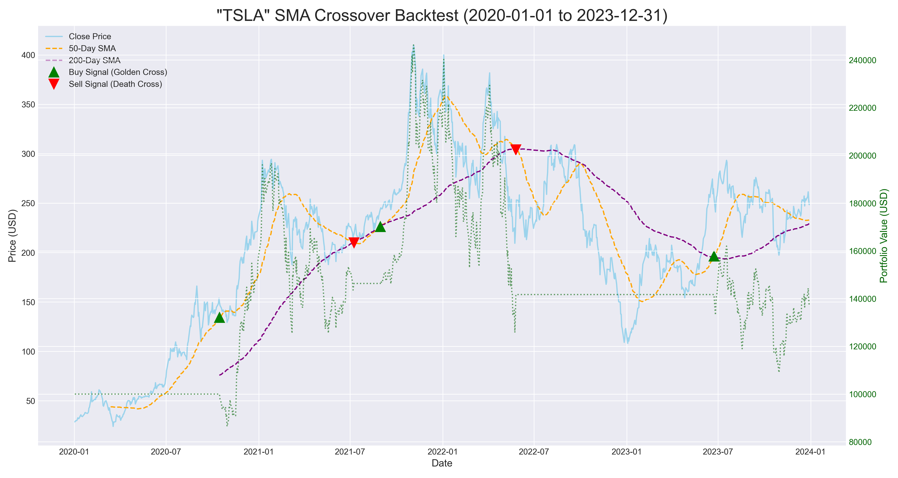

# FinSight: Algorithmic Trading Strategy Backtester

A professional-grade Python engine for backtesting quantitative trading strategies against historical market data. This project showcases the end-to-end workflow of a quantitative analyst: from data acquisition and strategy implementation to performance analysis and visualization.



---

## 📈 The Business Problem

In the multi-trillion-dollar world of finance, deploying capital without rigorous testing is not investing—it's gambling. Quantitative analysts ("Quants") and portfolio managers must validate their trading hypotheses before risking millions. A robust backtesting engine is the cornerstone of this process, providing the data-driven evidence needed to manage risk, evaluate strategy performance, and make informed capital allocation decisions.

## 💡 The Solution

FinSight is a lightweight yet powerful backtesting tool, built entirely in Python, that simulates the performance of a classic technical analysis strategy: the **Simple Moving Average (SMA) Crossover**. It provides a clear, quantitative comparison between the strategy's performance and a standard "Buy and Hold" benchmark.

### Key Features:

*   **Dynamic Data Acquisition:** Leverages the `yfinance` library to pull years of daily-adjusted stock data for any ticker from Yahoo Finance.
*   **Strategy Implementation:** Programmatically calculates short-term (50-day) and long-term (200-day) SMAs to identify high-probability "Golden Cross" (buy) and "Death Cross" (sell) signals.
*   **Realistic Portfolio Simulation:** A clean, robust simulation loop calculates daily portfolio value by tracking cash, shares held, and executing trades based on the strategy's signals.
*   **Insightful Performance Analytics:** Automatically calculates and displays critical metrics, including final portfolio value and total percentage return, for both the SMA strategy and the benchmark.
*   **Professional Visualization:** Generates a publication-quality chart using `matplotlib`, displaying the stock's closing price, the moving averages, and clear markers for each buy and sell transaction, including a secondary axis for portfolio value over time.

---

## 📊 Results & Impact

The backtest on Tesla Inc. (TSLA) from 2020 to 2023 reveals a fascinating outcome. While the "Buy and Hold" strategy yielded a higher absolute return during this period of extreme growth, the **SMA Crossover strategy demonstrated its value in risk management**, successfully selling before major downturns.

| Metric                  | SMA Crossover (50/200) | Benchmark (Buy & Hold) |
| :---------------------- | :--------------------: | :--------------------: |
| **Final Portfolio Value** |     `$137,227.31`      |     `$866,266.89`      |
| **Total Return**        |       `+37.23%`        |      `+766.27%`      |

*(Note: These results are from a specific backtest run. They are not investment advice.)*

This quantifiable data allows a portfolio manager to make an informed decision. For a high-growth, high-risk portfolio, "Buy and Hold" was superior. For a more conservative portfolio focused on capital preservation, the SMA strategy's ability to exit the market could be highly desirable in different market conditions.

---

## 🛠️ Technology Stack

*   **Core Language:** Python
*   **Data Acquisition:** `yfinance`
*   **Numerical & Data Analysis:** `pandas`, `numpy`
*   **Visualization:** `matplotlib`

---

## 🏁 Getting Started

### 1. Clone the Repository
```bash
git clone https://github.com/Zaid2044/FinSight-Trading-Backtester.git
cd FinSight-Trading-Backtester